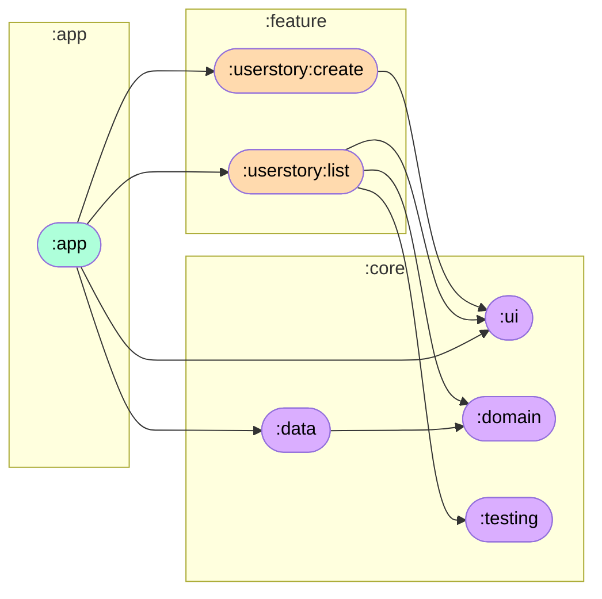

# Groomr

## Module Config

```mermaid

flowchart LR

  classDef appModule fill:#AEFFDA,color:#000
  classDef featureModule fill:#FFDAAE,color:#000
  classDef coreModule fill:#DAAEFF,color:#000
  
  subgraph :app
    app([:app]):::appModule
  end
  subgraph :feature
    app --> userstory:create([:userstory:create]):::featureModule
    app --> userstory:list([:userstory:list]):::featureModule
  end
  subgraph :core 
    userstory:create --> ui([:ui]):::coreModule
    userstory:list --> domain([:domain]):::coreModule
    userstory:list --> ui([:ui]):::coreModule
    userstory:list --> testing([:testing]):::coreModule
    data --> domain([:domain]):::coreModule
    app --> ui([:ui]):::coreModule
    app --> data([:data]):::coreModule
  end
```